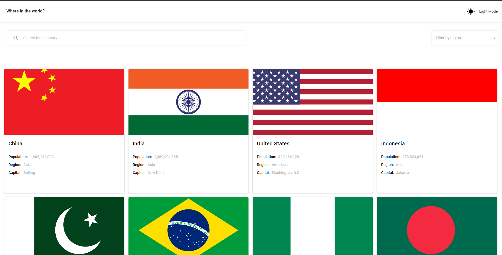

# REST Countries Explorer

This project was created with [Vue.js](https://vuejs.org/) and [Quasar Framework](https://quasar.dev/).

## Project Description

REST Countries Explorer is a web application that allows users to view country data from the REST Countries V2 API. Users can see all countries from the API on the homepage, search for a country using an input field, and filter countries by region. Additionally, users can click on a country to see more detailed information on a separate page, which utilizes client-side routing. When viewing the detailed information for a country, users can also click on the border countries listed to see detailed information for those countries.

## Installation

1. Clone the repository

2. Change into the project directory

3. Install the required dependencies:
```bash
npm install
```

4. Run the application: 
```bash
npm run dev
```

5. Open a web browser and navigate to `http://localhost:9000/`.

## Technologies Used
|                                                        Technology Icon                                                        | Technology Name |                                                      Technology Icon                                                        | Technology Name |                                                      Technology Icon                                                        | Technology Name |
| :---------------------------------------------------------------------------------------------------------------------------: | :-------------: | :---------------------------------------------------------------------------------------------------------------------------: | :-------------:  | :---------------------------------------------------------------------------------------------------------------------------: | :-------------: |
|  |      HTML       |   |       CSS       |  |      Sass       |
|  |   JavaScript    |  |   TypeScript    |  |     Vue.js      |
|  |      Quasar       | 

## A glimpse of the project.


